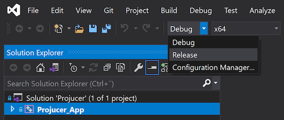
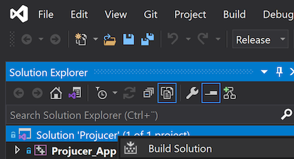
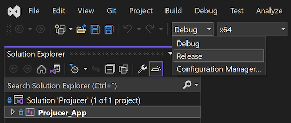
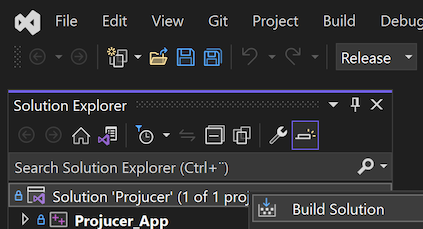
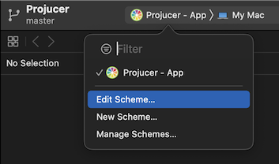
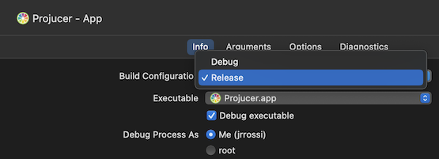
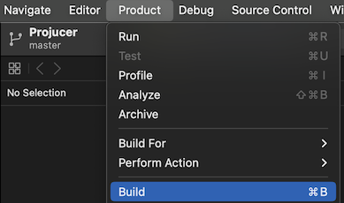

# Modern Real-Time Audio Programming Course

This repository contains code examples and framework to be used along the course.

## Pre-requisites

**MacOS**:
 - [XCode](https://developer.apple.com/xcode/) 
 - [Developer Command Line Tools](https://www.youtube.com/watch?v=sF9UszljnZU)

**Windows**:
 - [MS Visual Studio](https://visualstudio.microsoft.com/vs/community/) (2019/2022) - Community Edition is free.
 - [Git Bash](https://gitforwindows.org/)

**Nice to have**:
 - [Reaper](https://www.reaper.fm/download.php) - Fully featured DAW. Demo is free and fully functional.
 - [PluginDoctor](https://ddmf.eu/plugindoctor/) - Handy for audio/DSP debugging. Demo is free and fully functional.
 - [SourceTree](https://www.sourcetreeapp.com/) - If you prefer GUI for git.
 - [Surge](https://surge-synthesizer.github.io/) - FOSS synth, handy for quick testing in a DAW.
 - [SocaLabs Plugins](https://socalabs.com/) - Various useful free plugins, like osciloscope and tone generators.
 - [ASIO4ALL](https://asio4all.org/) - *Windows only*. In case you don’t have a soundcard with an ASIO driver.

## Cloning the Repository
If you have a [github account](https://docs.github.com/en/get-started/signing-up-for-github/signing-up-for-a-new-github-account) with a [SSH key setup](https://docs.github.com/en/authentication/connecting-to-github-with-ssh/adding-a-new-ssh-key-to-your-github-account):
```
git clone --recurse-submodules git@github.com:Neural-DSP/modern-rt-audio-course.git
```
Otherwise, the `https` will also work.
```
git clone --recurse-submodules https://github.com/Neural-DSP/modern-rt-audio-course.git
```

You won't be able to push to this repository. If you intend to push branches and commits, it's recommended to create your own fork.

## Building Projucer

`JUCE` comes as a [submodule](https://git-scm.com/book/en/v2/Git-Tools-Submodules) of the repository and can be found under the `dependencies` directory.
During the course, we will use [Projucer](https://docs.juce.com/master/tutorial_new_projucer_project.html) as a project management tool, but first you will need to build the application.

The `Projucer` app comes with ready-to-build projects for the main IDEs, which be found under `JUCE/extras/Projucer/Builds`. Select and open the appropriate one for your OS/IDE.

### Visual Studio 2019
Select the build configuration to `Release`.



Right-click `Solution 'Projucer'` to open the context-menu and click `Build Solution`.



After the build has completed, the app can be found under:

`JUCE/extras/Projucer/Builds/VisualStudio2019/x64/Release/App/Projucer.exe`.

### Visual Studio 2022
Sselect the build configuration to `Release`.



Then right-click `Solution 'Projucer'` to open the context-menu and click `Build Solution`.



After the build has completed, the app can be found under:

`JUCE/extras/Projucer/Builds/VisualStudio2022/x64/Release/App/Projucer.exe`.

### XCode
Open the build configuration menu by clicking `Projucer - App` on the central top bar.



On the configuration menu view, select `Release` for `Build Configuration`



Then on the  `Product` menu, click `Build`.



After the build has completed, the app can be found under:

`JUCE/extras/Projucer/Builds/MacOSX/build/Release/Projucer.app`